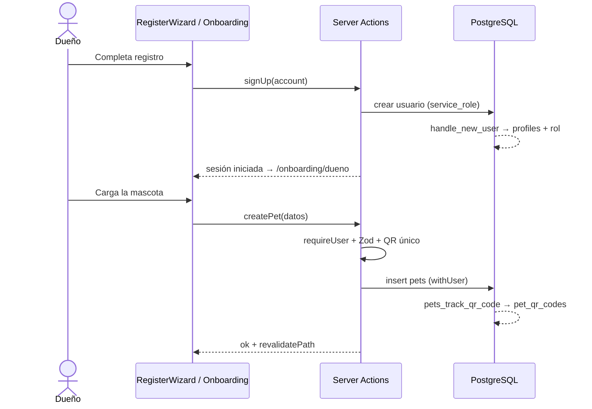
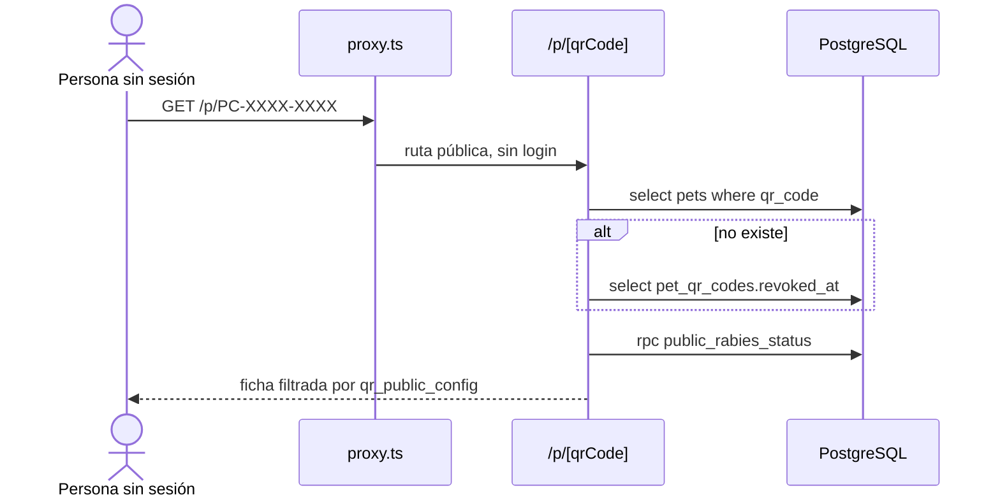
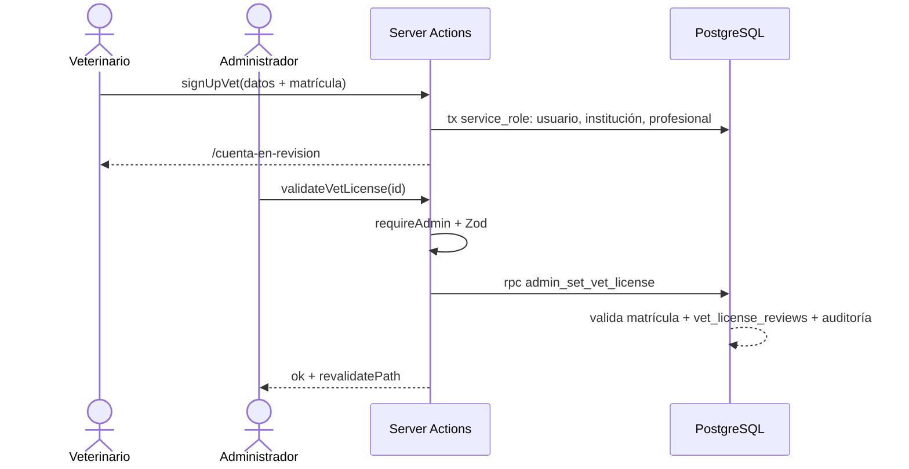
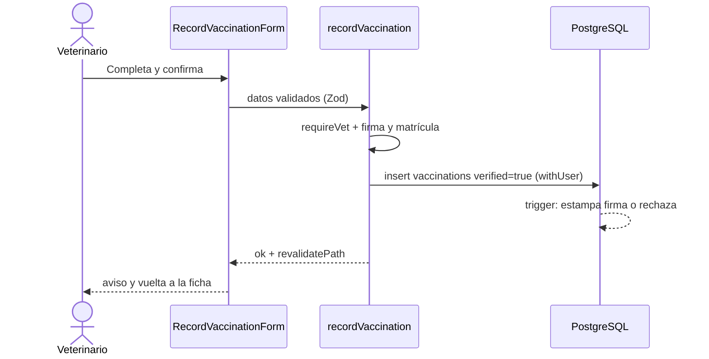
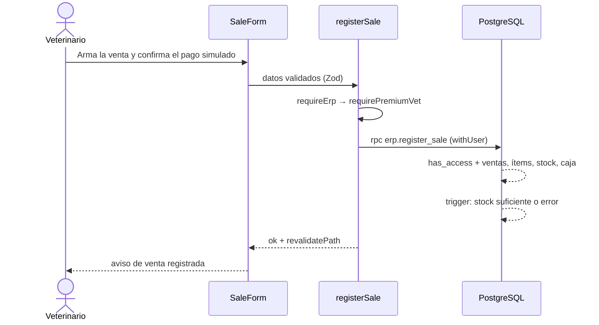

# Casos de uso

Los cinco casos de uso principales de PetCloud, con su descripción funcional y
el recorrido técnico de cada uno por las capas del sistema. Las rutas son
relativas a `PetCloud/`; los números de línea son orientativos.

## Cómo se comunica el front con el servidor

- **Server Actions en lugar de REST.** Las mutaciones son funciones marcadas con
  `"use server"` en `src/features/<área>/actions/*.ts`. Cuando un componente de
  cliente las llama, Next.js envía un `POST` a la URL actual con el encabezado
  `Next-Action`; no hay endpoints REST propios.
- **Solo dos rutas de API:**
  [`api/auth/[...nextauth]`](../src/app/api/auth/[...nextauth]/route.ts)
  (Auth.js) y
  [`api/storage/[bucket]/[...path]`](../src/app/api/storage/[bucket]/[...path]/route.ts)
  (archivos).
- **Protección de rutas en dos niveles.** [proxy.ts](../src/proxy.ts) lee la
  sesión, deja pasar las rutas públicas (por ejemplo `/p/...`, definidas en
  [app-routes.ts](../src/config/app-routes.ts)), manda a `/login?next=...` si no
  hay sesión y redirige al panel propio si el rol no corresponde. Además, cada
  página y cada acción vuelve a verificar en el servidor con un *guard*:
  `requireUser`, `requireVet`, `requireAdmin`, `requirePremiumVet`,
  `requireInstitutionOwner`, `requireErp`.
- **Acceso a datos** ([src/lib/db/index.ts](../src/lib/db/index.ts)):
  - `withUser(userId, fn)` (línea 72) abre una transacción en la que
    `auth.uid()` devuelve ese usuario, para que funciones SQL y triggers sepan
    quién opera.
  - `withServiceRole(fn)` (línea 97) ejecuta con `set local role service_role`,
    rol que los triggers de protección eximen; se usa en altas que el usuario no
    puede hacer por sí mismo.
  - `rpc(...)` (línea 115) invoca funciones SQL de una lista permitida.
  - La aplicación se conecta con el rol dueño de las tablas, por lo que las
    políticas RLS de las migraciones **no filtran**. La seguridad efectiva está
    en los guards del servidor, en los filtros explícitos de cada consulta y en
    lo que la base ejecuta siempre: triggers, restricciones y funciones
    `SECURITY DEFINER`.

---

## 1. Registrarse como dueño y registrar una mascota

- **Actor:** Dueño de mascota (usuario nuevo).
- **Objetivo:** crear su cuenta y dar de alta su primera mascota con un código QR
  propio.
- **Precondiciones:** el email no está registrado.

**Flujo principal**

1. El usuario elige "Registrarse" y completa nombre, apellido, email y
   contraseña, con perfil "Dueño".
2. El sistema crea la cuenta e inicia la sesión.
3. El sistema lo lleva al asistente de bienvenida.
4. El dueño carga los datos de su mascota (nombre, especie, raza, sexo, fecha de
   nacimiento, peso).
5. El sistema guarda la mascota y le asigna un código QR único (`PC-XXXX-XXXX`).
6. El dueño ve la mascota en "Mis mascotas", con su QR listo para la chapita.

**Flujos alternativos**

- A1. Datos inválidos: el formulario marca el campo y no envía.
- A2. Email en uso: el sistema informa que no puede completar el registro.
- A3. Fecha de nacimiento futura o peso fuera de rango: la base rechaza el alta y
  se pide corregir.

**Postcondiciones:** existen el usuario con rol dueño, su perfil y la mascota con
un QR activo registrado en el historial de códigos.

### Recorrido técnico

| Capa | Detalle |
|---|---|
| Pantalla | `/registro` → [registro/page.tsx](../src/app/%28auth%29/registro/page.tsx) con `RegisterWizard` ([register-wizard.tsx](../src/features/auth/components/register/register-wizard.tsx), línea 71). Luego `/onboarding/dueno` → [page.tsx](../src/app/onboarding/dueno/page.tsx) con [owner-onboarding-wizard.tsx](../src/features/onboarding/components/owner-onboarding-wizard.tsx). |
| Formulario y validación | React Hook Form + Zod: `accountSchema` en [auth-schemas.ts](../src/features/auth/schemas/auth-schemas.ts) (línea 73); `petBasicsSchema` en el asistente y `crearPetServerSchema` en [pet-schema.ts](../src/features/owner/schemas/pet-schema.ts) (línea 183) del lado servidor. |
| Server Action | `signUp` en [register-actions.ts](../src/features/auth/actions/register-actions.ts) (línea 119) → `register()` (línea 91): busca el email, crea el usuario con `withServiceRole` (error `23505` = email en uso) e inicia sesión con credenciales. `createPet` en [pets-actions.ts](../src/features/owner/actions/pets-actions.ts) (línea 116), protegida por `requireUser`. |
| Acceso a datos | El QR se genera con `generateUniqueQrCode` ([qr-code.ts](../src/lib/qr-code.ts), línea 62). `withUser` inserta en `pets` (y el primer registro en `weight_records`). |
| Base de datos | Trigger `on_auth_user_created` ([001_base_auth.sql](../db/migrations/001_base_auth.sql)) ejecuta `handle_new_user` ([049_handle_new_user_oauth_identity.sql](../db/migrations/049_handle_new_user_oauth_identity.sql)), que crea `profiles` y fija el rol; `profiles_protect_role` impide cambiarlo. Trigger `pets_track_qr_code` ([002_owner_data.sql](../db/migrations/002_owner_data.sql)) registra el código en `pet_qr_codes`. Restricciones `CHECK` de fecha y peso en [081_pets_check_fecha_y_peso.sql](../db/migrations/081_pets_check_fecha_y_peso.sql). |
| Respuesta | Tras el registro, redirección a `/onboarding/dueno` (destino por rol en [roles.ts](../src/config/roles.ts)). Tras crear la mascota, `revalidatePath` de `/mis-mascotas` e `/inicio`. |

---

## 2. Consultar la ficha pública de una mascota por QR

- **Actor:** Cualquier persona (sin sesión), por ejemplo quien encuentra a la
  mascota.
- **Objetivo:** ver los datos públicos de la mascota y cómo contactar al dueño.
- **Precondiciones:** la mascota tiene un QR asignado.

**Flujo principal**

1. La persona escanea la chapita; se abre `/p/<código>`.
2. El sistema busca la mascota por el código.
3. Muestra solo los datos que el dueño habilitó como públicos y el estado de la
   vacuna antirrábica.

**Flujos alternativos**

- A1. Código con formato inválido: se informa "QR inválido".
- A2. Código que existió pero fue reemplazado: se informa que la chapita fue
  revocada.
- A3. Código inexistente: se informa que no se encontró la mascota.

**Postcondiciones:** no se modifica ningún dato. La historia clínica nunca se
expone.

### Recorrido técnico

| Capa | Detalle |
|---|---|
| Pantalla | `/p/[qrCode]` → [page.tsx](../src/app/p/[qrCode]/page.tsx) (`generateMetadata` y la página), que renderiza [collar-profile.tsx](../src/features/public-qr/components/collar-profile.tsx). [proxy.ts](../src/proxy.ts) la deja pasar sin sesión. |
| Formulario y validación | No hay formulario. `isQrCode` valida el formato antes de consultar. |
| Server Action | No hay acción: es una lectura en un Server Component. |
| Acceso a datos | `getPublicPetByQr` en [public-pet.ts](../src/features/public-qr/data/public-pet.ts) (línea 37) consulta `pets` con `getDb()`; si no está, revisa `pet_qr_codes.revoked_at`. Como la conexión es dueña de las tablas, RLS no filtra: la privacidad la aplica el código, que selecciona columnas puntuales y las proyecta según `qr_public_config` ([public-pet-projection.ts](../src/features/public-qr/lib/public-pet-projection.ts)). |
| Base de datos | `public_rabies_status` ([050_public_rabies_status.sql](../db/migrations/050_public_rabies_status.sql)), invocada por `rpc` dentro de `withServiceRole`, devuelve solo el estado antirrábico a partir de vacunaciones verificadas. |
| Respuesta | Página pública con la ficha. Cuando el dueño cambia su configuración de privacidad, `updateQrConfig` ([pets-actions.ts](../src/features/owner/actions/pets-actions.ts), línea 302) revalida `/p/<código>`. |

---

## 3. Registrarse como veterinario y validar la matrícula

- **Actores:** Veterinario (alta) y Administrador (validación).
- **Objetivo:** que el veterinario cree su cuenta y su institución, y que un
  administrador valide su matrícula para habilitar los registros firmados.
- **Precondiciones:** el email y la matrícula no están registrados; existe un
  administrador con sesión iniciada.

**Flujo principal**

1. El usuario elige "Registrarse" con perfil "Veterinario".
2. Completa sus datos, los de la veterinaria y su matrícula profesional.
3. El sistema crea la cuenta, la institución y el profesional como responsable.
4. La cuenta queda "en revisión" y el veterinario ve esa pantalla al ingresar.
5. El administrador abre "Validaciones", revisa la solicitud y la aprueba.
6. El sistema marca la matrícula como validada (y la institución, si el
   veterinario es su responsable) y registra la decisión.
7. El veterinario accede a su panel con permisos completos.

**Flujos alternativos**

- A1. Matrícula ya registrada: se informa en el formulario y no se crea nada.
- A2. Email en uso: no se completa el registro.
- A3. El administrador rechaza la matrícula: la cuenta sigue sin validar.

**Postcondiciones:** queda una revisión registrada y una entrada en la auditoría
de administración. Con la matrícula validada el veterinario puede firmar
registros.

### Recorrido técnico

| Capa | Detalle |
|---|---|
| Pantalla | `/registro` ([register-wizard.tsx](../src/features/auth/components/register/register-wizard.tsx), línea 91). Administrador: `/admin/validaciones` → [page.tsx](../src/app/admin/validaciones/page.tsx) con [validations-view.tsx](../src/features/admin/components/validations/validations-view.tsx) (línea 73). |
| Formulario y validación | `vetInfoSchema` en [auth-schemas.ts](../src/features/auth/schemas/auth-schemas.ts) (línea 129); `licenseReviewSchema` en [admin-schemas.ts](../src/features/admin/schemas/admin-schemas.ts) (línea 17). |
| Server Action | `signUpVet` en [register-actions.ts](../src/features/auth/actions/register-actions.ts) (línea 132): verifica la matrícula y, en una transacción `withServiceRole`, crea usuario, `vet_institutions` y `vet_professionals`. `validateVetLicense` en [license-actions.ts](../src/features/admin/actions/license-actions.ts) (línea 65), protegida por `requireAdmin`. |
| Acceso a datos | Inserciones con `withServiceRole` (error `23505` de matrícula → error de formulario). La validación usa `withUser` + `rpc("admin_set_vet_license")`. |
| Base de datos | `vet_professionals_protect_privileges` ([019_protect_vet_privileges.sql](../db/migrations/019_protect_vet_privileges.sql)) y `vet_institutions_protect_privileges` ([080_vet_institucion_sin_validar.sql](../db/migrations/080_vet_institucion_sin_validar.sql)) exigen `service_role` para el alta. `admin_set_vet_license` (080, `SECURITY DEFINER`) comprueba `is_platform_admin`, actualiza la matrícula y la institución, inserta en `vet_license_reviews` y registra en la auditoría *append-only* ([048_audit_log_append_only_and_suspension_guard.sql](../db/migrations/048_audit_log_append_only_and_suspension_guard.sql)). |
| Respuesta | El veterinario va a `/cuenta-en-revision` ([roles.ts](../src/config/roles.ts); en logins posteriores, [session-actions.ts](../src/features/auth/actions/session-actions.ts)). El administrador ve un aviso y la lista se revalida. |

---

## 4. Registrar una vacunación firmada

- **Actor:** Veterinario con matrícula validada.
- **Objetivo:** dejar constancia firmada de una vacuna aplicada a un paciente.
- **Precondiciones:** sesión iniciada, matrícula validada y firma digital
  cargada.

**Flujo principal**

1. El veterinario abre la ficha del paciente y elige "Registrar vacunación".
2. Completa vacuna, laboratorio, lote, dosis, vía, fecha de aplicación y
   próxima dosis.
3. Confirma el registro.
4. El sistema guarda la vacunación como verificada, con la firma vigente del
   profesional.
5. El dueño ve la vacuna verificada en la libreta de su mascota; si es
   antirrábica, se refleja en la ficha pública.

**Flujos alternativos**

- A1. Sin firma cargada: se informa que debe cargarla en Ajustes.
- A2. Matrícula sin validar: se informa que no puede firmar todavía.
- A3. Datos inválidos: el formulario marca los campos.

**Postcondiciones:** la vacunación queda verificada y asociada a la firma del
profesional, que no puede modificarse.

### Recorrido técnico

| Capa | Detalle |
|---|---|
| Pantalla | `/veterinaria/pacientes/[patientId]/vacunacion` → [page.tsx](../src/app/veterinaria/pacientes/[patientId]/vacunacion/page.tsx) con [record-vaccination-form.tsx](../src/features/vet/components/vaccination/record-vaccination-form.tsx). |
| Formulario y validación | React Hook Form + `vaccinationSchema` en [vet-schemas.ts](../src/features/vet/schemas/vet-schemas.ts) (línea 95). |
| Server Action | `recordVaccination` en [vaccination-actions.ts](../src/features/vet/actions/vaccination-actions.ts) (línea 52): `requireVet`, luego `motivoSinFirma` corta con `sin-firma` o `sin-matricula`. |
| Acceso a datos | `withUser` inserta en `vaccinations` con `applied_by_id`, `verified: true` y `created_by_id`. |
| Base de datos | Trigger `vaccinations_protect_verification` ([043_vaccination_declaration_review.sql](../db/migrations/043_vaccination_declaration_review.sql)) con la función de [065_vet_signature_gate.sql](../db/migrations/065_vet_signature_gate.sql): estampa `current_vet_signature_id()` ([063_vet_signatures.sql](../db/migrations/063_vet_signatures.sql)) y rechaza si falta firma o matrícula (`is_validated_vet()`). Las firmas son inmutables (063 y [066_vet_signature_object_immutable.sql](../db/migrations/066_vet_signature_object_immutable.sql)). |
| Respuesta | `revalidatePath` del paciente, `/veterinaria/vacunaciones` y la mascota del dueño; el formulario muestra un aviso y vuelve a la ficha. |

---

## 5. Registrar una venta en el ERP (Premium simulado)

- **Actor:** Veterinario de una institución con Premium activo.
- **Objetivo:** registrar una venta de productos, descontar stock y registrar el
  cobro.
- **Precondiciones:** institución con suscripción Premium (simulada, sin cobro
  real), productos con stock y permiso de ventas.

**Flujo principal**

1. El responsable activa Premium desde la pantalla de planes (pago simulado).
2. El veterinario abre "ERP → Ventas".
3. Elige cliente, productos, cantidades y medio de pago.
4. Confirma en la ventana de pago simulado.
5. El sistema registra la venta, sus ítems, el movimiento de stock y el
   movimiento de caja o de cuenta corriente.
6. Se muestra un aviso y la venta aparece en el listado.

**Flujos alternativos**

- A1. Sin Premium: se redirige a la pantalla de planes.
- A2. Stock insuficiente: se informa y no se registra nada.
- A3. Sin permiso de ventas: la operación es rechazada.

**Postcondiciones:** venta, ítems, stock y caja quedan actualizados en una sola
transacción (todo o nada).

### Recorrido técnico

| Capa | Detalle |
|---|---|
| Pantalla | `/veterinaria/premium` con [premium-view.tsx](../src/features/vet/components/premium/premium-view.tsx). `/veterinaria/erp/ventas` → [page.tsx](../src/app/veterinaria/erp/ventas/page.tsx) con [sale-form.tsx](../src/features/erp/components/sales/sale-form.tsx) y [payment-simulation-modal.tsx](../src/features/erp/components/sales/payment-simulation-modal.tsx). |
| Formulario y validación | React Hook Form + `saleSchema` en [sale-schemas.ts](../src/features/erp/schemas/sale-schemas.ts) (línea 51). |
| Server Action | `simulatePremiumCheckout` en [premium-simulation-actions.ts](../src/features/vet/actions/premium-simulation-actions.ts) (línea 85, `requireInstitutionOwner`). `registerSale` en [sale-actions.ts](../src/features/erp/actions/sale-actions.ts) (línea 88), protegida por `requireErp` → `requirePremiumVet` ([erp-session.ts](../src/features/erp/lib/erp-session.ts), [vet-premium.ts](../src/features/vet/lib/vet-premium.ts)). |
| Acceso a datos | Premium: `withServiceRole` hace *upsert* en `vet_subscriptions` con estado `authorized`. Venta: `erpWrite` ([erp-sql.ts](../src/features/erp/lib/erp-sql.ts)) = `withUser` + `rpc("erp.register_sale")`. |
| Base de datos | `institution_has_premium` ([040_vet_subscriptions.sql](../db/migrations/040_vet_subscriptions.sql)). `erp.register_sale` ([113_erp_punto_de_venta.sql](../db/migrations/113_erp_punto_de_venta.sql)) verifica `erp.has_access(inst, 'ventas')` e inserta en `erp.sales`, `erp.sale_items`, `erp.stock_movements` y caja o cuenta corriente. El trigger `erp_movements_check_stock` ([102_erp_stock_no_negativo.sql](../db/migrations/102_erp_stock_no_negativo.sql)) llama a `erp.check_stock_suficiente` ([112_erp_tenant_isolation.sql](../db/migrations/112_erp_tenant_isolation.sql), con bloqueo `FOR UPDATE`) y `erp_movements_apply` ([101_erp_stock.sql](../db/migrations/101_erp_stock.sql)) actualiza el stock. |
| Respuesta | Errores de stock traducidos a mensajes claros; `revalidatePath` de ventas, stock y caja; aviso de éxito en el formulario. |

