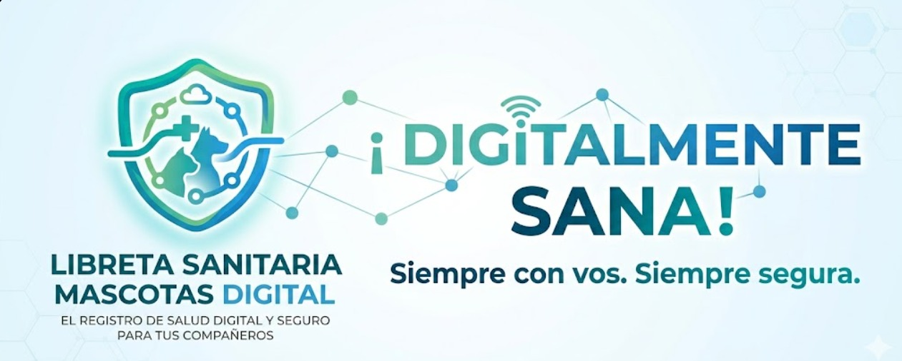

### Grupo-2--SistemaLibreta-Sanitaria-
### Augusto Fiorito y Francisco Osenda
<div align="center">
    
  
  # ✨ Libreta Sanitaria Digital - PetCloud ✨
</div>

>[!IMPORTANT]
>[Documentación del proyecto (V3, actualizada)](PetCloud/docs/Libreta%20Sanitaria%20Digital%20-%20V3%202026.docx)
>
>[Casos de uso](PetCloud/docs/casos-de-uso.md) · [Arquitectura](PetCloud/docs/arquitectura.md) · [Reglas de negocio](PetCloud/docs/reglas-negocio.md) · [Cómo ejecutarlo](PetCloud/docs/desarrollo/entorno-local.md)
>
>[Diagrama de Clases](https://lucid.app/lucidchart/f0e4fb76-1a8e-4995-be2d-61d92bf68501/edit?page=0_0&invitationId=inv_ba4a12ba-e3d8-4172-9df8-5c23d8b7959d#)
>
>[Mockups](https://www.figma.com/proto/rL316115OMlUjJtVWd4iok/Libreta-Sanitaria-Para-Mascotas?node-id=124-9&starting-point-node-id=124%3A9)
>
>Versiones anteriores (históricas): [V1 - 2025](https://docs.google.com/document/d/1U2uex2z5IXFOhL5VIA10oJmFmmevZJxMwCiDuYnZph4/edit?usp=sharing) · [V2 - 2026](https://docs.google.com/document/d/1si8TRnH2X6WVdd95F68OWchCHARanhwpZQUsX6KvRlk/edit?usp=sharing)

## Tecnologías

Next.js 16 · React 19 · TypeScript · Tailwind CSS · PostgreSQL 16 en Azure Database for PostgreSQL · Drizzle ORM · Auth.js

## Cómo ejecutarlo

La aplicación está en [`PetCloud/`](PetCloud). Los pasos para levantarla en local (variables de entorno, migraciones y datos de demo) están en [`PetCloud/docs/desarrollo/entorno-local.md`](PetCloud/docs/desarrollo/entorno-local.md).

```bash
cd PetCloud
npm install
npm run db:migrate
npm run dev
```

La documentación técnica está en [`PetCloud/docs/`](PetCloud/docs).
