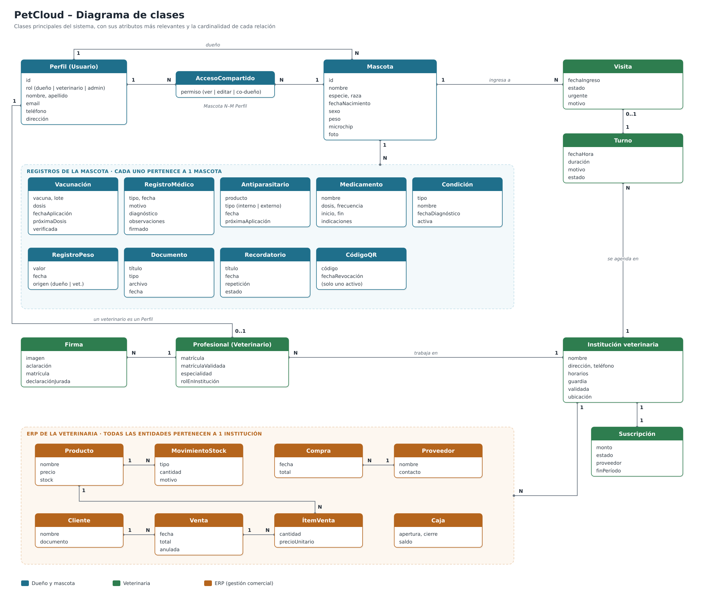

### Grupo-2--SistemaLibreta-Sanitaria-
### Augusto Fiorito y Francisco Osenda
<div align="center">
    
  
  # ✨ Libreta Sanitaria Digital - PetCloud ✨
</div>

>[!IMPORTANT]
>[Documentación del proyecto (V3)](PetCloud/docs/Libreta%20Sanitaria%20Digital%20-%20V3%202026.docx)
>
>[Diagrama de clases](PetCloud/docs/diagrama-de-clases.png)
>
>[Mockups](https://www.figma.com/proto/rL316115OMlUjJtVWd4iok/Libreta-Sanitaria-Para-Mascotas?node-id=124-9&starting-point-node-id=124%3A9)
>
>Versiones anteriores: [V1 - 2025](https://docs.google.com/document/d/1U2uex2z5IXFOhL5VIA10oJmFmmevZJxMwCiDuYnZph4/edit?usp=sharing) · [V2 - 2026](https://docs.google.com/document/d/1si8TRnH2X6WVdd95F68OWchCHARanhwpZQUsX6KvRlk/edit?usp=sharing)

## Diagrama de clases



## Cómo ejecutarlo

Pasos:

```bash
cd PetCloud
npm install
npm run db:migrate
DEMO_PASSWORD=<clave> npm run seed:demo
npm run dev
```

Luego abrir http://localhost:3000.

Cuentas de demostración (todas usan la clave elegida en `DEMO_PASSWORD`):

- Dueño: `dueno@petcloud.local`
- Veterinario: `vet@petcloud.local`
- Veterinario pendiente de validación: `vet.pendiente@petcloud.local`
- Administrador: `admin@petcloud.local`
